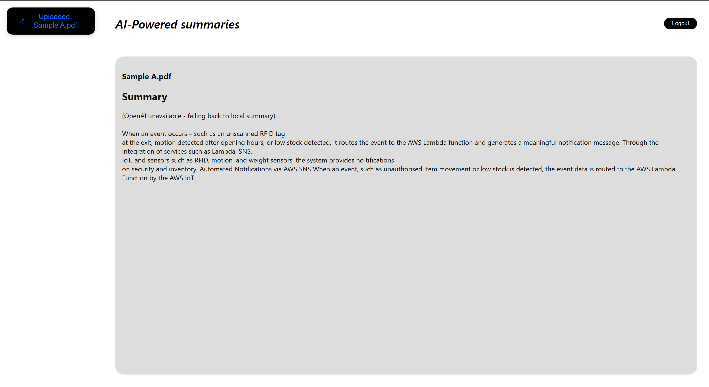
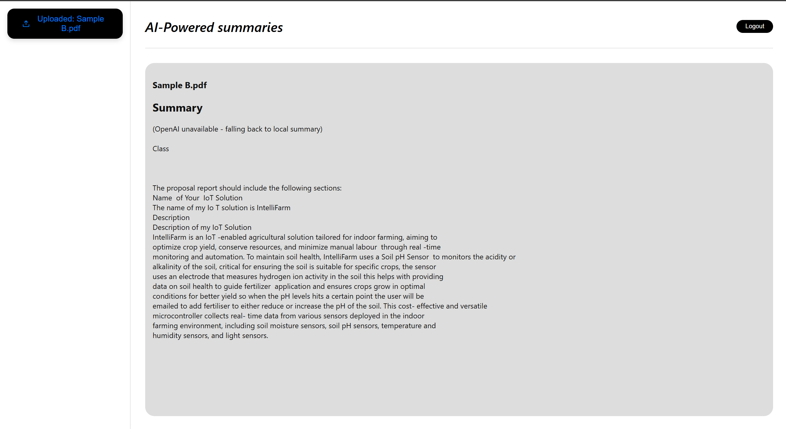
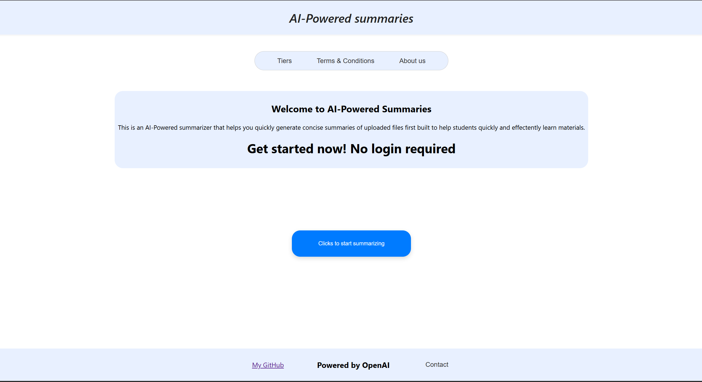

# ai-summarizer
Application capable of summarizing a pdf file using AI.

# Overview
This application uses OpenAI to summarise uploaded files, It has the capability to summarise local text as well however that aspect of the app is not implemented into the UI/UX of the application. This application was created to help students understand and learn class materials more effectively.

# Composition
This application primarly uses python for the backend and react for the frontend

# Setup
A .env is needed where a OPENAI_API_KEY is needed. The key is obtainable at https://openai.com/api/.

# Summary 
After setup simply upload a file from your local pc by clicking on the black button

Once file is uploaded summary will appear in the main container where if OpenAI is unavailable a fall back system was implemented which gives a local summary

Example A:

Example B:

# Draft 2
Improved UI of the Home page.

